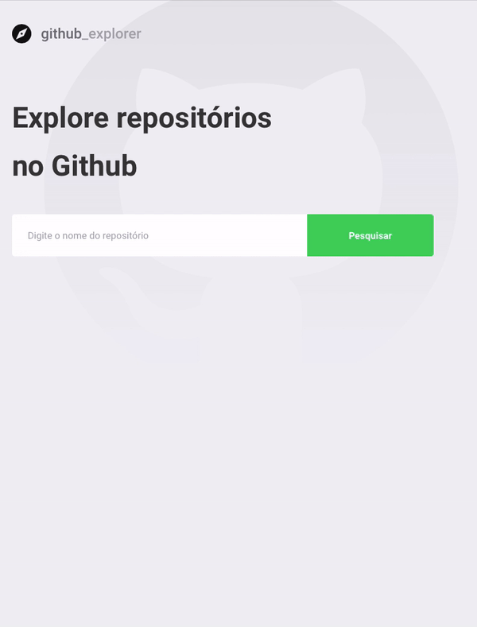

Github Explorer

## Features

This app features all the latest tools and practices in web development!

- ⚛️ **React Js**
- ⚛️ **Typescript**
- ⚛️ **Styled Components**

## Getting started

1. Clone this repo using `git clone https://github.com/felipereisdev/github_explorer`
2. Move yourself to the appropriate directory: `cd github_explorer` 
3. Run `yarn`, in each folder, to install dependencies 

### Getting started

1. Run `yarn start` to start the web application

## License

This project is licensed under the MIT License - see the [LICENSE](https://opensource.org/licenses/MIT) page for details.
